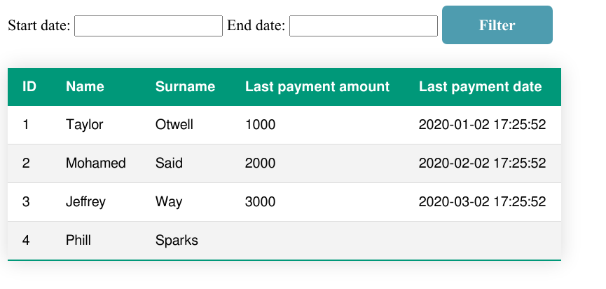

# This is a very simple Laravel project.

## Installation
1. Create a `.env` file from the available template and edit the required configurations
2. Run `composer install` to install the required dependencies
3. Run the artisan `migrate` command and use the two seeders named 'ClientsTableSeeder' and 'PaymentsTableSeeder' to populate the database

## Available endpoints
### List all clients and their last payment
To see the last payments of all users, do a `GET` request to the following endpoint:
```
/payments
```

### Retrieve the last payment of each client for a specific period
To retrieve the payments for a specific period, do a `GET` request to the following endpoint:
```
/payments/{start_date}/{end_date}
```

## Available commands
### Export the payments of the last 30 days in a .csv file
Use the following Laravel command to export the .csv file in folder storage/app:
```
php artisan payments:export
```



